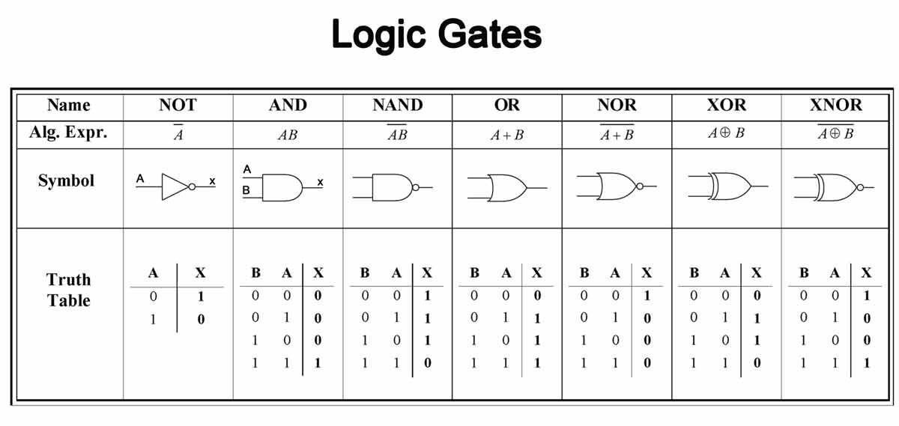
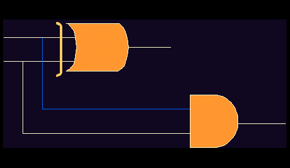
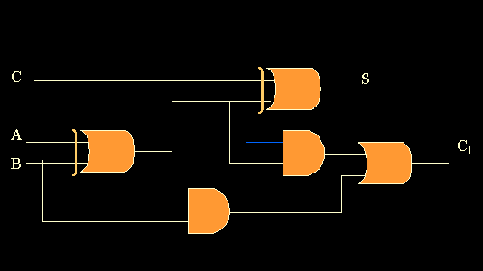
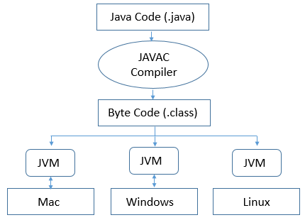

#  CPU Architecture, x86, the JVM and Kotlin

## Resources
* [How a CPU is Made](https://www.tomshardware.com/picturestory/514-intel-cpu-processor-core-i7.html)
* [CPU Architecture](https://www.tutorialspoint.com/computer_logical_organization/cpu_architecture.htm)
* [y86 Instruction Set](http://web.cse.ohio-state.edu/~reeves.92/CSE2421sp13/PracticeProblemsY86.pdf)
* [The Java Virtual Machine](https://www.geeksforgeeks.org/jvm-works-jvm-architecture/)
* [Kotlin Programming Language](https://en.wikipedia.org/wiki/Kotlin_programming_language#Philosophy)

## CPU Architecture
The CPU is the central processing unit of a computer. It's responsible for
performing all computation in your mchine. Let's look at the anatomy of a CPU
and see how these computers actually work.

Let's make a distinction between abstract idea-like things and the physical
implementations of these ideas. Here's a list of low-level to high-level ideas
that make up a computer. I say these are idea-like because we can talk about
how they should work and how we can use them without having to actually build
them. Throughout the history of computers engineers have had ideas of how to
use computers before figuring out machinery to actually build out their ideas.

* Abstract Zeros and Ones
* Abstract boolean logic (AND, OR, NAND, XOR gates)
* Abstract CPU instructions (x86)
* Abstract languages (Java)
* Abstract CPUs! (the Java Virtual Machine)
* Languages built on JVM (Kotlin)

Now Let's consider the physical aspects of these. 

* Physical Zeros and Ones
* Transistors (tiny switches triggered by eletrical signals)
* Physical logic gates
* Encoding CPU instructions
* Interpreting instructions
* Reading data, calculating data, writing data, storing data
* 

## Logic Gates


* [Half Adder Circuit](http://isweb.redwoods.edu/INSTRUCT/CalderwoodD/diglogic/half-add.htm)
* [Full Adder Circuit](http://isweb.redwoods.edu/INSTRUCT/CalderwoodD/diglogic/full.htm)




## CPU Architecture
* [CPU Architecture](https://www.tutorialspoint.com/computer_logical_organization/cpu_architecture.htm)

The CPU operates in "ticks" or "cycles." It performs one operation at a time,
very very rapidly. CPUs have basically the following components:

* The **program counter** that keeps track of what position of code it's executing.
* Only a few **registers** that store intermediate values.
* Access to memory to read and write data beyond the few registers.
* Special **flags** to store information about the last operation
  * Was the last math operation equal to zero?
  * Was the last math operation negative?
  * Did the last math operation cause an integer overflow?
* The **ALU** arithmetic logic unit responsible for
  * addition
  * subtraction
  * increment
  * decrement
  * Bitwise AND, OR, XOR
  * Bit-shift operations

## Assembly Language: x86 and y86 Instruction Sets
* [y86 Instruction Set](http://web.cse.ohio-state.edu/~reeves.92/CSE2421sp13/PracticeProblemsY86.pdf)
* [x86 Assembly Language](https://en.wikipedia.org/wiki/X86_assembly_language)

All these small operations come together to build the complex programming
interactions we're familiar with. The language of small operations that the CPU
executes is called Assembly. The most common form of Assembly is x86, built and
supported by Intel and their chips. x86 supports computer chips all the way
back to 1972 when Intel was selling the Intel 8008. Though it supports old
processors it's absolutely been built on top of since then too.


x86 is a complex assembly language. It has to deal with variety in processors
like whether they are 32-bit processors or 64-bit processors. To avoid needless
complexity we'll use an educational subset of x86 called `y86`.

Here's what a C program and one equivelant in assembly looks like:

```c
int len2(int a[])
{
 int len = 0;
 while (*a++)
len++;
 return len;
}
```

```x86
.L11:
  incl %ecx
  movl (%edx), %eax
  addl $4, %edx
  testl %eax, %eax
  jne .L11
```

* `.L11` is a label, like a method name.
* `incl` increment the long value in the `%ecx` register
* `movl` move the value stored in at the memory address `(%edx)` to the `%eax` register
* `addl` add four to the value of `%edx`
* `testl` ANDs `%eax` with itself to see if it is zero
* `jne` jumps to .L11 if the previous result was not zero

### Abstract vs Physical
* [y86 Instruction Set](http://web.cse.ohio-state.edu/~reeves.92/CSE2421sp13/PracticeProblemsY86.pdf)

There's still a difference here between the idea of the assembly language and
how it's phyiscal stored. Look at the PDF to see how instructions are actually
stored in binary.

The CPU can look at the first bytes of the instruction to figure out how the
CPU should react and compute the instruction, then it activates those circuits
and computes away.

We're just looking at the `y86` instruction set and it's own encoding here.
There are many others. It would be possible to have the same _abstract_
assembly language and then have a different phyiscal encoding of it on a chip.

In the early days of computers there were all sorts of chips and all sorts of
different custom encodings. Even recently it was a big deal when Apple chose to
switch from their PowerPC chip to using Intel chips in their desktops and
laptops. Switching from PowerPC to Intel allowed Apple to run native assembly
code on their machines. This made it especially easier for people to run
windows on their machines and eased the transition of people switching from PC
to Mac.

## The Java Virtual Machine: Why Java instead of C?
The C language depended on people writing compilers for every different CPU and
instruction set on the market. C is a fast language because programs are
compiled all the way down to assembly and run "on the iron" directly on the
CPU. Java code is actually run on a virtual machine so there's a layer between
the actual CPU and a program that runs the Java code.

The Java Virtual Machine abstracted away the CPU so people could "write Java
programs once and then run them anywhere." Now only some programmers had to
write programs for the JVM that fit every CPU.



## Kotlin
There's langauges that have been built on top of the Java Virtual Machine.
Scala, Clojure and Kotlin are all their own langauges that have been built
actually on top of the Java Virtual Machine. There's even implementatins of
Ruby and Python (JRuby and Jython) that run on top of the Java Virtual Machine.
